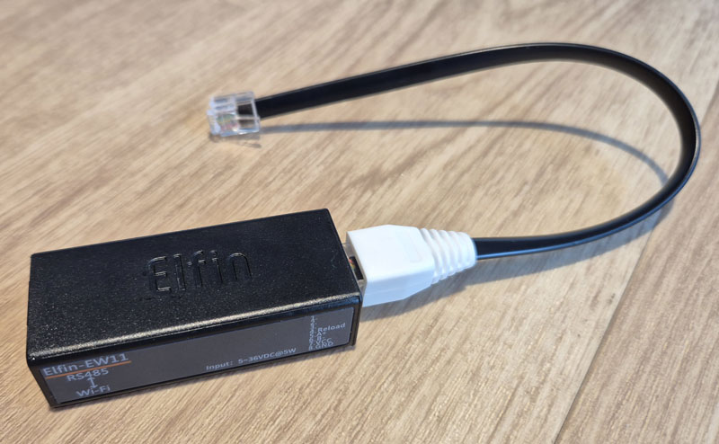
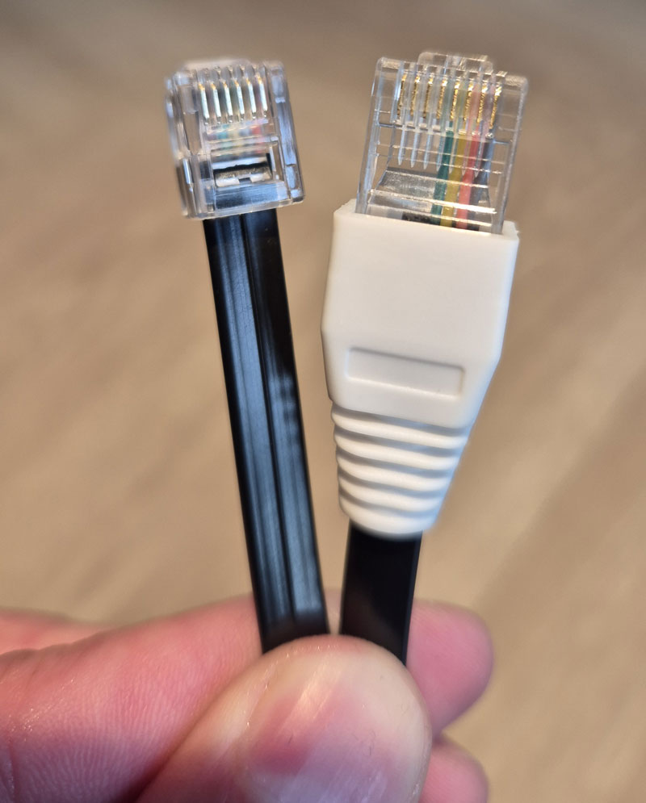

# ComAir HRUC-Plus Modbus Integration for Home Assistant

[](https://github.com/hacs/integration)
[](https://www.home-assistant.io/)

Custom Home Assistant integration for **ComAir HRUC-Plus 3** / **Vent-Axia Sentinel Kinetic Advance** MVHR ventilation units via Modbus RTU over TCP.

## Features

- **40 Entities**: Comprehensive sensor and control coverage
- **Config Flow UI**: Add via Settings → Integrations (no YAML editing)
- **BMS Settings**: Configuration matches Vent-Axia Connect app
- **Climate Control**: HVAC-like entity with preset modes
- **Energy Tracking**: Integrated energy sensor for HA Energy dashboard
- **Heat Recovery**: Calculated efficiency sensor
- **Translations**: English, Slovak, Czech, Polish — terminology taken from the manufacturer's own manuals (Comair HRUC-Plus NL and PL editions)

## Entities

| Platform | Count | Entities |
|----------|-------|----------|
| sensor | 20 | Temperatures (4), Humidity (2), CO2 (2), Fan RPM (2), Fan Speed % (2), Power, Energy, Heat Recovery, Timers (3), Diagnostics (3) |
| binary_sensor | 6 | Attention LED, Cooling Enable, Preheater Enable, Controlled Cooling/Heating, Summer Bypass |
| switch | 10 | Virtual Inputs 1-10 (BMS control mapping) |
| button | 1 | Sync Clock (write HA time to MVHR) |
| select | 1 | Ventilation Mode (Auto/Low/Medium/High/Boost) |
| number | 1 | Mode Duration (15-240 min, step 15) |
| climate | 1 | Ventilation with preset modes |

### About the Summer Bypass sensor

The unit publishes no documented summer-bypass flag, so **Summer Bypass** is *inferred* from
the air temperatures: when the bypass is open, supply tracks intake and exhaust tracks
extract. When intake and extract are within 3 °C of each other there is not enough signal to
judge, and the sensor reports `unknown` rather than guessing.

That inference has now been checked against a unit's own bypass status by a user on a
different model: when the bypass was genuinely open the sensor read `on`, and when it was
closed the sensor read `off` or `unknown`. So it is sound, with `unknown` as the honest
answer in the narrow-spread case rather than a wrong one.

The manual's own rule ("Zomer bypassmodus") is that the bypass engages only when the
indoor and outdoor thresholds are both exceeded **and the outdoor temperature is below the
indoor temperature**, and that it disengages as soon as either threshold is crossed back.
The sensor uses the necessary half of that: whenever intake is at or above extract the
damper cannot be open, so it reports a confident `off` instead of `unknown`. The
thresholds themselves are user-configurable on the unit and not exposed over Modbus, so
they are not assumed. `unknown` is now limited to the genuinely ambiguous band — outdoor
cooler than indoor, but by less than 3 °C.

The manual also describes bypass modes the bus cannot report: *Off*, *Normal*, *Evening
cooling* (runs 5 hours, then reverts) and *Night cooling* (runs until the outdoor
temperature rises again).

**There is no register that reports the bypass directly.** Register 30025, listed in the
official Gen V map only as *"Other output sources… TODO/TBC"*, was tested as a candidate and
ruled out: it sits permanently at `1` on both an HRUC-Plus 3 VR and a Sentinel Econiq SC
while the real bypass opens and closes. The relay outputs 30021–30024 (cooling enable,
preheater enable, controlled cooling/heating) are not the bypass either — they appear to
drive external heating and cooling equipment and follow temperature.

---

## Required Hardware

### 1. ComAir HRUC-Plus Ventilation Unit

The **ComAir HRUC-Plus 3** (also sold as **Vent-Axia Sentinel Kinetic Advance**) is a whole-house heat recovery ventilation unit (MVHR) with built-in Modbus RS485 support via the BMS connector.

**Supported models:**
| Device | Variants | Tested |
|--------|----------|--------|
| ComAir HRUC-Plus 3 | 250, 350 | 350 tested |
| Vent-Axia Sentinel Kinetic Advance | 250S/SX, 350S/SX (LH/RH) | 350SX RH tested |
| Vent-Axia Sentinel Econiq | SC | Tested — confirmed working by a user |
| Vent-Axia Sentinel Kinetic Apex | Gen V | Should work (same Modbus map) |

All Gen V units share the same Modbus register map, which is why models beyond the tested
ones generally work. If you get another model running, please open an issue so it can be
added here.

### 2. Modbus RTU to TCP Gateway

You need a **WiFi or Ethernet RS485 gateway** to bridge the unit's RS485 bus to your network. The gateway converts Modbus RTU (serial) to Modbus TCP (network).

| Gateway | Input Voltage | Interface | Tested |
|---------|--------------|-----------|--------|
| **Elfin EW11** | 5-18V DC | WiFi | Yes |
| **Elfin EW11A** | 5-36V DC | WiFi | Yes |
| Waveshare RS485 to ETH | 5-36V DC | Ethernet | Should work |
| USR-W610 | 5V DC | WiFi | Should work |

The **Elfin EW11(A)** is recommended because it can be powered directly from the BMS connector, requires no external power supply, and fits neatly inside the ventilation unit.

The main difference between the **EW11** and **EW11A** is the supported DC input voltage range. The **EW11A** supports a higher input voltage and can be powered from either 5 V or 24 V. If you are using the **EW11**, make sure you use the 5 V supply and do not connect it to the 24 V power wire.


### 3. RJ12 Cable (6P6C)

A standard **RJ12 6-pin cable** to connect the gateway to the BMS connector on the HRUC unit. You can use:
- RJ12 breakout adapter *OR*
- A cut and stripped RJ12 cable *OR*
- A cut RJ12 cable with an RJ45 connector crimped directly onto the other end (**compatible only with the Elfin EW11/EW11A**).




If you hold the connectors like this, cut wires 1 and 2 from the RJ12 cable. Then insert wires 3, 4, 5, and 6 into RJ45 slots 5, 6, 8, and 7 respectively.

---

## BMS Connector Pinout

The HRUC-Plus has a **6P6C RJ12** BMS connector (J20) for Modbus RS485 communication.


### RJ12 Pin Numbering

```
Looking at RJ12 jack (clip facing down):

        ┌─────────────────────────┐
        │  1   2   3   4   5   6  │
        │ 24V GND  A   B  GND +5V │
        └──────────┬──────────────┘
                   │
                 clip
```

### Complete Pinout

| Pin | Signal | Description | Connect to Gateway |
|-----|--------|-------------|-------------------|
| 1 | P24VF9 | +24V DC (fused 500mA) | **VCC** (if gateway supports 24V) |
| 2 | GND | Ground | (alternative GND) |
| 3 | MOD A | RS485 Data+ | **A** |
| 4 | MOD B | RS485 Data- | **B** |
| 5 | GND | Ground | **GND** |
| 6 | P5VF10 | +5V DC (fused 500mA) | **VCC** (if gateway needs 5V) |

### Wiring Diagram

```
HRUC BMS RJ12 (J20)          Gateway Terminal
─────────────────────        ────────────────────
Pin 1 or 6 (power) ──────── VCC
Pin 3 (MOD A)  ───────────── A  (Data+)
Pin 4 (MOD B)  ───────────── B  (Data-)
Pin 5 (GND)    ───────────── GND
```


### Power Pin Selection

| Pin | Voltage | Use for |
|-----|---------|---------|
| Pin 1 | 24V | Gateways rated 5-36V (e.g. Elfin EW11A) |
| Pin 6 | 5V | Gateways rated 5V only |

Both pins are fused at 500mA via F9 (24V) and F10 (5V).

### RS485 Termination

The BMS board has a 120Ω terminator (R51) enabled via jumper **J4**:
- Enable if gateway is at end of RS485 bus
- Enable if cable length > 10 meters
- Enable if communication errors occur

---

## Gateway Configuration

This integration speaks **Modbus RTU over TCP**: Home Assistant builds the complete RTU frame (including the CRC) and the gateway must pass the bytes through **unchanged**. The gateway must therefore be a transparent serial bridge — it must *not* do Modbus protocol conversion.

### Serial settings

| Setting | Value |
|---------|-------|
| **Protocol** | **None** (transparent) — see warning below |
| **CLI** | **Disable** — see warning below |
| Baud Rate | 115200 |
| Data Bits | 8 |
| Parity | None |
| Stop Bits | 1 |
| Flow Control | `Disable` or `Half-Duplex` — both confirmed working |
| Buffer Size | 512 |
| Gap Time | anywhere in 10–50 — both ends of that range confirmed working |

RS485 is a two-wire bus and therefore always half duplex; that is a property of the
wiring, not a setting you need to hunt for. The EW11A exposes a single **Flow Control**
dropdown in which `Half-Duplex` is one of the values, and either it or `Disable` works.

`Frame Length` and `Frame Time` are **not** on the Serial Port Settings page. They exist
only in the gateway's configuration export, and the defaults are fine — if you cannot find
them in the web interface, nothing is wrong.

### Network settings

| Setting | Value |
|---------|-------|
| Protocol | TCP Server |
| Local Port | 502 |
| Route | Uart |
| Security | None |

> **Two settings must be right, and both fail the same silent way.**
>
> **Protocol = `None`.** The Elfin EW11A offers `Modbus` in the Protocol dropdown. That
> mode makes the gateway expect **Modbus TCP** (MBAP-framed) requests from the network and
> silently discard the RTU frames this integration sends.
>
> **CLI = `Disable`.** With CLI set to `Serial String` the gateway watches the serial
> stream for its escape sequence (`+++`) so it can drop into command mode — meaning it
> inspects, and can absorb, bytes in transit. Modbus RTU is raw binary in which any byte
> pattern may occur, so a gateway hunting for a trigger string is not a clean pipe.
>
> Either mistake produces `No response received after 3 retries` with perfect wiring.
> See [Troubleshooting](#no-response-received-after-3-retries).

The values above are read from a working EW11A, not from a datasheet.

### EW11A Serial Port Settings

This is a correctly configured EW11A — note **Protocol Settings → Protocol = `None`**, which
is the setting that makes the gateway a transparent bridge:


### EW11A Configuration Screenshots

**Protocol Settings:**


**Route Settings:**


### Vent-Axia Connect App BMS Settings

The Modbus settings can be verified in the Vent-Axia Connect app under Advanced Settings → Modbus:


---

## Installation

### Method 1: HACS (Recommended)

1. Open HACS in Home Assistant
2. Click **Integrations**
3. Click the three dots menu → **Custom repositories**
4. Add repository URL: `https://github.com/Koky05/comair-modbus-homeassistant`
5. Select category: **Integration**
6. Click **Add**
7. Search for "ComAir HRUC-Plus Modbus"
8. Click **Download**
9. Restart Home Assistant

### Method 2: Manual Installation

1. Download the latest release from [GitHub](https://github.com/Koky05/comair-modbus-homeassistant/releases)

2. Copy the `comair_modbus` folder to your Home Assistant custom_components directory:
   ```
   config/
   └── custom_components/
       └── comair_modbus/
           ├── __init__.py
           ├── climate.py
           ├── config_flow.py
           ├── const.py
           ├── coordinator.py
           ├── manifest.json
           ├── sensor.py
           ├── binary_sensor.py
           ├── select.py
           ├── number.py
           ├── strings.json
           └── translations/
               ├── en.json
               ├── sk.json
               └── cs.json
   ```

3. Restart Home Assistant

---

## Configuration

1. Go to **Settings** → **Devices & Services**
2. Click **+ Add Integration**
3. Search for "ComAir HRUC-Plus Modbus"
4. Enter your gateway configuration:

| Field | Default | Description |
|-------|---------|-------------|
| Gateway IP Address | *(required)* | IP address of your Modbus gateway |
| Modbus TCP Port | 502 | TCP port for Modbus communication |
| Device ID (Slave Address) | 2 | Modbus slave address of the HRUC unit |
| Baud Rate | 115200 | Serial baud rate |
| Data Bits | 8 | Number of data bits |
| Parity | None | Parity setting |
| Stop Bits | 1 | Number of stop bits |

5. Click **Submit**

The integration will test the connection and create all entities.

---

## Sensor Details

### Temperature Sensors

| Sensor | Register | Description |
|--------|----------|-------------|
| Intake Temperature | 30100 | Outside air entering the unit |
| Supply Temperature | 30110 | Heated/cooled air to rooms |
| Extract Temperature | 30120 | Room air being extracted |
| Exhaust Temperature | 30130 | Air being expelled outside |

### Environmental Sensors

| Sensor | Register | Description |
|--------|----------|-------------|
| Intake Humidity | 30101 | Outside air humidity (%) |
| Extract Humidity | 30121 | Room air humidity (%) |
| Intake CO2 | 30102 | Outside CO2 level (ppm) — if sensor installed |
| Extract CO2 | 30122 | Room CO2 level (ppm) — if sensor installed |

### Fan & Power Sensors

| Sensor | Register | Description |
|--------|----------|-------------|
| Supply Fan RPM | 30014 | Supply fan speed (RPM × 0.1) |
| Extract Fan RPM | 30016 | Extract fan speed (RPM × 0.1) |
| Power | 30010 | Current power consumption (W) |
| Energy | — | Accumulated energy (kWh), calculated from Power |
| Heat Recovery Efficiency | — | Calculated from temperatures (%) |

### Status Sensors

| Sensor | Register | Description |
|--------|----------|-------------|
| Run Time | 30001 | Total operating days |
| Service Timer | 30002 | Months until service required |
| Filter Timer | 30003 | Months until filter change |
| Faults | 30004-05 | Active fault codes |
| Warnings | 30006-07 | Active warning codes |
| Notifications | 30008-09 | Active notifications |

---

## Ventilation Modes

Control ventilation via the **select** entity or **climate** presets:

| Mode | Default Fan Speed | Description |
|------|-------------------|-------------|
| Auto | Automatic | Automatic control based on sensors |
| Low | 20% | Low fan speed (PR1) |
| Medium | 30% | Medium fan speed (PR2, Normal) |
| High | 50% | High fan speed (PR3) |
| Boost | 100% | Maximum ventilation (PR4, Purge) |

Fan speeds are configurable per mode via the Vent-Axia Connect app.

---

## Energy Dashboard

The integration provides an **Energy** sensor (`sensor.comair_hruc_plus_energy`) that tracks total energy consumption in kWh. This sensor has `state_class: total_increasing` and can be used directly in the Home Assistant Energy dashboard.

---

## Dashboard Card

A ready-to-use `picture-elements` Lovelace card that mimics the physical HRUC-Plus LCD controller display is included at [`docs/lovelace_controller_card.yaml`](docs/lovelace_controller_card.yaml).

**Features:**
- Transparent background (works with any HA theme)
- Outdoor/indoor temperature, humidity, heat recovery efficiency
- Mode-dependent fan icon (auto, speed-1, speed-2, speed-3, boost alert)
- Supply/extract fan speed percentages
- Air quality smiley (happy/neutral/sad based on faults/warnings)
- Power, energy, runtime, filter and service timers

**Installation:**
1. Copy SVG icons from `docs/icons/` to `/config/www/comair/` on your HA
2. Copy `docs/icons/lcd_transparent.png` to `/config/www/comair/`
3. Dashboard → Edit → Add Card → Manual → paste content from `docs/lovelace_controller_card.yaml`
4. **Adjust the entity IDs.** Home Assistant derives an entity ID from the entity's
   *translated* name when it is first created, so they depend on the UI language you
   installed with. The card ships with the IDs from a Slovak install
   (`sensor.comair_hruc_plus_3_teplota_nasavania`); on English you will have
   `sensor.comair_hruc_plus_3_intake_duct_temperature`. Search-and-replace before use.

---

## Fault, Warning and Notification Codes

The unit reports these as three 32-bit bitmasks. The **Faults**, **Warnings** and
**Notifications** sensors show the active codes as their state (`OK`, `W-12`, or
`W-12, W-15`), and carry the meaning of each one in attributes:

```yaml
state: "W-12, W-15"
attributes:
  codes: ["W-12", "W-15"]
  descriptions:
    - "W-12: Filter cleaning or replacement overdue"
    - "W-15: BMS offline"
```

The state stays a compact code list so automations and history keep working; the
descriptions are attributes, which is where a template or a card can pick them up.
An undocumented bit is passed through as raw hex (`0x40000000`) rather than hidden.

| Faults | | Warnings | | Notifications | |
|---|---|---|---|---|---|
| F-1 | Supply air thermistor | W-1 | Supply air temperature | N-1 | Filter cleaning/replacement due soon |
| F-2 | Extract air thermistor | W-2 | Exhaust air temperature | N-2 | Service due soon |
| F-3 | Supply fan | W-3 | Preheated air temperature | N-3 | Device offline |
| F-4 | Extract fan | W-4 | Intake air humidity | N-4 | Cooling suspended |
| F-8 | Supply air too cold | W-5 | Extract air humidity | N-5 | Cooling insufficient |
| F-32 | HMI communication lost | W-6 | Supply air flow | | |
| | | W-7 | Extract air flow | | |
| | | W-8 | Left filter sensor | | |
| | | W-9 | Right filter sensor | | |
| | | W-10 | System overpressure | | |
| | | W-11 | Preheater activated | | |
| | | W-12 | Filter cleaning or replacement overdue | | |
| | | W-13 | Service interval overdue | | |
| | | W-14 | Lost connection to sensors or controllers | | |
| | | W-15 | BMS offline | | |
| | | W-18 | Bypass or heat exchanger efficiency | | |
| | | W-19 | Preheater IO offline | | |
| | | W-20 | Cooling unit offline | | |

Sourced from the manufacturer's manuals, which do not cover the same set — the Dutch
edition documents F-8, W-18 to W-20 and N-3 to N-5 but omits W-8 and W-9; the Polish
edition (01/2024) documents W-8 and W-9 but omits the others. Two disagreements are
left as the Dutch edition has them and noted in `const.py`: it calls F-1 the supply
thermistor where Polish calls it the inlet thermistor, and W-2 the exhaust
temperature where Polish calls it the extract temperature.

**How warnings clear**, per the Dutch manual: W-1 to W-7, W-10, W-11 and W-20 clear
once the unit recovers and is power cycled; W-12 and W-13 clear once the filter or
service values are reset.

> **Older controllers use a different scheme.** An earlier HRUC-Plus edition (manual
> 475340, same 10040001xx reference numbers) reports faults as additive numbers rather
> than F-/W-/N- codes — `01` fan left, `02` fan right, `04` temperature sensor left, `08`
> right, and so on, summed together, so `03` means both fans. This integration reads the
> Gen V bitmask registers and decodes the F-/W-/N- scheme; if your controller shows plain
> numbers instead, it predates what these registers expose.

---

## Modbus Register Map


---

## Troubleshooting

### Diagnostic script

Before changing anything, run [`tools/gateway_test.py`](tools/gateway_test.py). It needs
only Python 3 (no Home Assistant, no `pymodbus`) and can run from any PC on the same
network, or from the *Advanced SSH & Web Terminal* add-on:

```bash
python3 tools/gateway_test.py 192.168.1.50
```

It tests the TCP connection, sends a request in both RTU-over-TCP and Modbus TCP
framing, sweeps device IDs 1–16, and prints which side of the chain is broken.

### `No response received after 3 retries`

This error means the TCP connection to the gateway **succeeded** and the request was
sent, but nothing came back from the RS485 side — complete silence rather than
corrupted data. The network half of the setup is therefore already correct. Two
possibilities remain, in order of likelihood:

**1. The gateway never puts the request on the RS485 wire.**

- Serial settings: **Protocol = None**. If it is set to `Modbus`, the gateway expects
  Modbus TCP from the network and drops the RTU frames — this is by far the most
  common cause.
- Network settings: Protocol = `TCP Server`, Local Port = `502`, Route = `Uart`.
- Confirmation: in `tools/gateway_test.py`, if test 3 (Modbus TCP framing) gets a reply
  while test 2 (RTU over TCP) does not, the gateway is in conversion mode.

**2. The request reaches the wire, but the unit does not answer.**

- Open the gateway's status page and watch the serial Tx/Rx counters while the script
  runs. Tx increasing but Rx flat means the unit is not responding.
- Verify the wires are on the **BMS RJ12 connector (J20)**. The connectors labelled
  `+ A B -` are the *sensor* connectors and carry no Modbus.
- Check GND is connected, not only A and B.
- Confirm the gateway is an **EW11A** (RS485, terminals A/B/C/D). The plain EW11 is
  RS232 and cannot talk to the unit.
- Try swapping A and B — but only after Protocol = None is confirmed, otherwise two
  variables change at once.
- Verify baud rate and parity match the Vent-Axia Connect app (Advanced Settings →
  Modbus): 115200 / 8 / None / 1.

The J4 terminator and alternative device IDs are *not* likely causes: a missing
terminator does not produce total silence, and while the gateway is misconfigured
every device ID fails, so sweeping IDs proves nothing.

### Cannot Connect to Gateway

- Verify gateway IP address is correct
- Check gateway is powered and on network: `ping <gateway_ip>`
- Verify TCP port 502 is accessible
- Verify the gateway is in TCP Server mode on port 502

### Cannot Communicate with HRUC Unit

- Check the gateway serial Protocol is `None`, not `Modbus`
- Check Device ID is correct (default: 2)
- Verify RS485 wiring (A→A, B→B, GND→GND) on the BMS RJ12 connector
- Check gateway serial settings match (115200/8/N/1)
- Try enabling RS485 termination (jumper J4) if the cable is longer than 10 m

### Sensors Show "Unavailable"

- Wait for first data poll (up to 30 seconds)
- Check Home Assistant logs for errors
- Verify Modbus communication with test script

### CO2 Sensors Show "Unknown"

- Your unit does not have CO2 sensors installed
- This is normal — the sensors will show as "Unknown"

### Test Modbus Connection

With `pymodbus` available (inside the Home Assistant environment, for example). If you
do not have `pymodbus`, use [`tools/gateway_test.py`](tools/gateway_test.py) instead — it
uses only the Python standard library.

```python
from pymodbus.client import ModbusTcpClient
from pymodbus.framer import FramerType

client = ModbusTcpClient('192.168.x.x', port=502, framer=FramerType.RTU)
client.connect()

# Read intake temperature (device_id=2)
result = client.read_input_registers(address=99, count=1, device_id=2)
if not result.isError():
    temp = result.registers[0] / 10
    print(f"Intake Temperature: {temp}°C")
else:
    print(f"Error: {result}")

client.close()
```

---

## Dependencies

- Home Assistant 2024.1.0 or newer
- pymodbus >= 3.6.0 (installed automatically)

---

## Documentation

| File | Description |
|------|-------------|
| [BMS_WIRING_GUIDE.md](BMS_WIRING_GUIDE.md) | Detailed wiring instructions |
| [MODBUS_CONFIRMED_SETTINGS.md](MODBUS_CONFIRMED_SETTINGS.md) | Confirmed Modbus register documentation |
| [MODBUS_ANALYSIS.md](MODBUS_ANALYSIS.md) | Modbus register map analysis |

---

## Credits

- **Peter Koval** ([@Koky05](https://github.com/Koky05)) — Development
- **Vent-Axia / Ventilair** — BMS pinout documentation and technical support

---

## License

This project is licensed under the MIT License — see the [LICENSE](LICENSE) file for details.

---

## Contributing

Contributions are welcome! Please open an issue or pull request on [GitHub](https://github.com/Koky05/comair-modbus-homeassistant).

---

## Disclaimer

This is an unofficial integration not affiliated with Vent-Axia or Ventilair. Use at your own risk.
